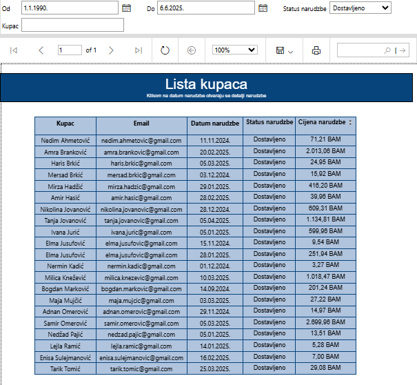

# E-Trgovina reports

This repository contains visual reports generated for the  E-commerce database.  
All reports were created using **SQL Server Reporting Services (SSRS)** and **SQL Server Data Tools (SSDT)**, with data sourced directly from **SQL Server Management Studio (SSMS)** queries.  

The purpose of these reports is to provide clear, actionable insights into key sales indicators, customer behavior, product performance, and trends over time. Each report combines SQL queries with SSRS visuals to give management and analysts a comprehensive overview of the business, with both detailed and summary-level information.

---

## Key sales indicators – composite dashboard


This report presents a composite visual composed of four fixed charts, providing an overview of the most important sales indicators without additional filtering. The visual is static and provides a quick insight into the business status.

- **Top-left:** Countries with the highest sales  
  - Bar chart showing countries generating the highest revenue (total sales in BAM), sorted in descending order.
- **Top-right:** Employee efficiency  
  - Chart showing the Top 5 employees by total revenue (BAM), ranking individual sales performance.
- **Bottom-left:** Best-selling products  
  - Displays the top 5 products generating the highest revenue, sorted by maximum sales value.
- **Bottom-right:** Orders distribution by customers  
  - Pie chart showing each customer’s share of total orders (BAM), highlighting customers with the greatest impact on revenue.

This clear layout allows management to identify key revenue sources and leading performers in the sales process at a glance.


## Customer list report



The "Customer List" report allows users to filter orders based on multiple parameters:

- **Order date** – from/to (`@DatumOd`, `@DatumDo`)  
- **Order status** – dropdown selection (`@Status`, e.g., "Completed", "Pending", "Cancelled")  
- **Customer name** – partial match on first or last name (`@Kupac`)  

The report interface provides a table of orders matching the entered criteria. Each record includes an interactive **Order Date** column, which allows users to drill through to a detailed report for that specific order.

**SQL query used for this report:**

```sql
SELECT 
    k.Ime + ' ' + k.Prezime AS Kupac,
    k.Email,
    n.NarudzbaID,
    n.DatumNarudzbe,
    n.Status,
    SUM(s.Kolicina * p.Cijena * (1 - s.Popust / 100)) AS UkupnaCijena
FROM 
    Kupci k
JOIN 
    Narudzbe n ON k.KupacID = n.KupacID
JOIN 
    StavkeNarudzbe s ON n.NarudzbaID = s.NarudzbaID
JOIN 
    Proizvodi p ON s.ProizvodID = p.ProizvodID
WHERE
    (
        (@DatumOd IS NULL OR @DatumDo IS NULL) 
        OR 
        (n.DatumNarudzbe BETWEEN @DatumOd AND @DatumDo)
    )
    AND (
        @Status IS NULL OR @Status = '' OR @Status = 'Svi' OR n.Status = @Status
    )
    AND (
        @Kupac IS NULL 
        OR @Kupac = '' 
        OR k.Ime LIKE '%' + @Kupac + '%' 
        OR k.Prezime LIKE '%' + @Kupac + '%'
    )
GROUP BY 
    k.Ime, k.Prezime, k.Email, n.NarudzbaID, n.DatumNarudzbe, n.Status
ORDER BY 
    k.Prezime, k.Ime, n.DatumNarudzbe;
```

## Best-selling products report


This report provides a graphical overview of the best-selling and least-selling products based on total sales value (in BAM). Users can interactively filter the data to focus on specific categories or sales ranges.

**Available filters:**

- **Product category** – dropdown list to select a category (e.g., electronics, clothing, food) (`@VrstaProizvodaID`)  
- **Min/Max sales range** – filter products within a specific sales range, highlighting top-performing or underperforming items (`@RasponProdaje`)

The visual uses a **bar chart** to emphasize products with the highest and lowest revenue. This allows quick identification of sales trends and products that either generate the most revenue or require additional attention in the sales strategy.

**SQL query used for this report:**

```sql
WITH ProdajaProizvoda AS (
    SELECT 
        p.ProizvodID,
        p.Naziv AS NazivProizvoda,
        vp.Naziv AS VrstaProizvoda,
        SUM(sn.Kolicina * p.Cijena * (1 - sn.Popust / 100.0)) AS UkupnaProdajaBAM
    FROM 
        StavkeNarudzbe sn
        JOIN Proizvodi p ON sn.ProizvodID = p.ProizvodID
        JOIN VrsteProizvoda vp ON p.VrstaProizvodaID = vp.VrstaProizvodaID
        JOIN Narudzbe n ON sn.NarudzbaID = n.NarudzbaID
    WHERE
        (@VrstaProizvodaID = vp.VrstaProizvodaID)
    GROUP BY 
        p.ProizvodID, p.Naziv, vp.Naziv
)

SELECT TOP 5 *
FROM ProdajaProizvoda
ORDER BY 
    CASE 
        WHEN @RasponProdaje = 'Min' THEN UkupnaProdajaBAM 
        ELSE NULL 
    END ASC,
    CASE 
        WHEN @RasponProdaje IS NULL OR @RasponProdaje = 'Max' THEN UkupnaProdajaBAM 
        ELSE NULL 
    END DESC;
```

## Products list and product details report

### Products List


The "Products List" report displays essential information about all products in the system, including:

- Product name  
- Manufacturer  
- Product category  
- Production date  
- Number of units sold  
- Total revenue  
- Number of orders containing the product  
- Current stock level  

**Visual alerts:**  
- If the stock of a product is below 15 units, the quantity is highlighted in **red**, drawing attention to low inventory levels.  

**Drill-through functionality:**  
- Clicking on any product name opens the **Product Details** report, providing additional insights.

### Product Details (Drill-through)


The **Product Details** report shows detailed information for a single product selected from the Products List:

- Total units sold  
- Total revenue  
- Number of orders in which the product appeared  

This combination allows quick identification of low-stock products and gives access to detailed sales analysis for individual items, helping management make informed inventory and sales decisions.

**SQL query used for these reports:**

```sql
SELECT 
    p.ProizvodID,
    p.Naziv AS NazivProizvoda,
    p.Cijena AS CijenaProizvoda,
    SUM(sn.Kolicina) AS UkupnoProdanoKomada,
    CONCAT(FORMAT(SUM((p.Cijena * sn.Kolicina) * (1 - sn.Popust / 100)), 'N2'), ' BAM') AS UkupnaZarada,
    COUNT(DISTINCT sn.NarudzbaID) AS BrojNarudzbi
FROM Proizvodi p
INNER JOIN StavkeNarudzbe sn ON p.ProizvodID = sn.ProizvodID
WHERE 
    (@NazivProizvoda IS NULL OR @NazivProizvoda = '' OR p.Naziv LIKE '%' + @NazivProizvoda + '%')
GROUP BY p.ProizvodID, p.Naziv, p.Cijena
ORDER BY 
    UkupnoProdanoKomada DESC;
```


## Sales trend report (monthly)


This report shows the **monthly sales trend** for a selected product category, helping to analyze seasonal fluctuations and purchasing patterns.  
In the example, the trend is shown for the category "Shoes and Footwear," but the user can select any product category via a dropdown to view its sales performance over time.

**Observations from the chart:**

- Gradual growth from September to January, peaking in January (2,326.34 BAM), likely due to post-holiday shopping or seasonal discounts.  
- A decline in February, followed by a gradual increase in sales until April.  

**Chart type:** Line chart, with values displayed above each point to visualize the pace and intensity of changes clearly.

**Usefulness of the report:**

- Track seasonal trends and prepare inventory accordingly  
- Plan marketing campaigns during lower sales months  
- Identify the best period to launch new products  

**SQL query used for this report:**

```sql
SELECT 
    FORMAT(P.DatumPlacanja, 'yyyy-MM') AS Mjesec,
    VP.Naziv AS VrstaProizvoda,
    SUM(ISNULL(SN.Kolicina * PR.Cijena * (1 - ISNULL(SN.Popust, 0) / 100.0), 0)) AS UkupnaProdaja
FROM Placanja P
JOIN Narudzbe N ON P.NarudzbaID = N.NarudzbaID
JOIN StavkeNarudzbe SN ON SN.NarudzbaID = N.NarudzbaID
JOIN Proizvodi PR ON PR.ProizvodID = SN.ProizvodID
JOIN VrsteProizvoda VP ON VP.VrstaProizvodaID = PR.VrstaProizvodaID
WHERE (@VrstaProizvoda = 'Svi' OR VP.Naziv = @VrstaProizvoda)
GROUP BY FORMAT(P.DatumPlacanja, 'yyyy-MM'), VP.Naziv
ORDER BY Mjesec, VrstaProizvoda;
```
